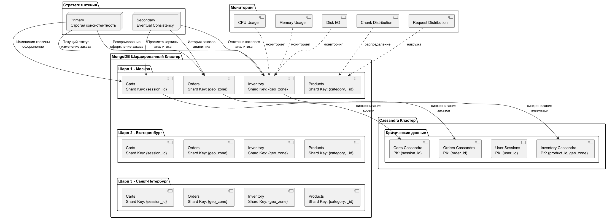
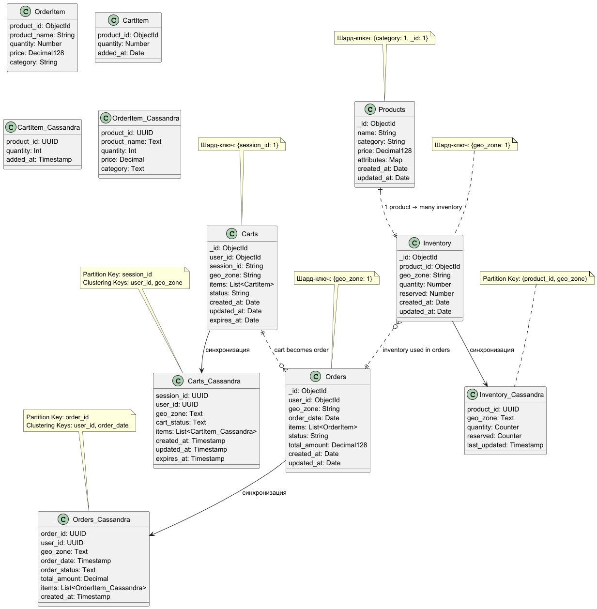
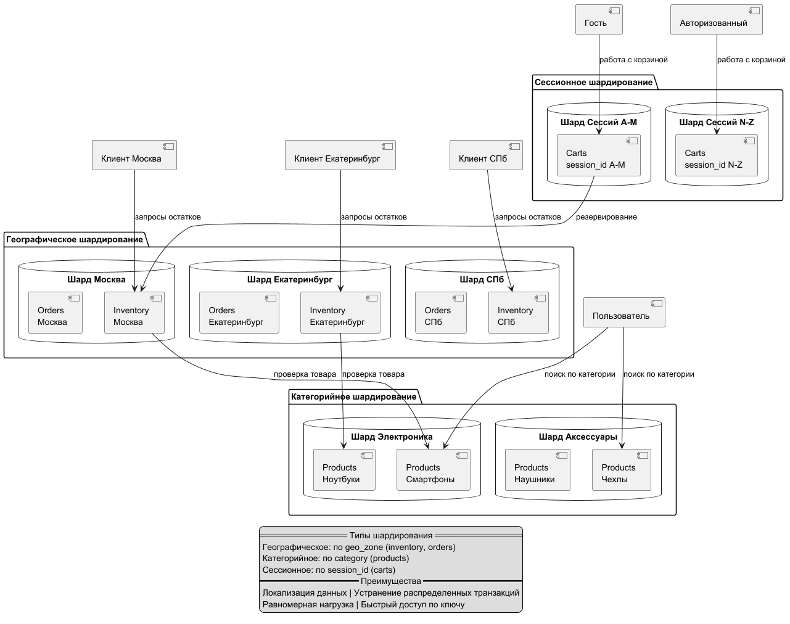

# Масштабируемая система для "Мобильного мира"
## 1. Обзор архитектуры
Система "Мобильного мира" использует гибридный подход с двумя базами данных:

MongoDB - основная база данных с шардированием для горизонтального масштабирования

Cassandra - для критически важных данных, требующих высокой доступности и низкой latency

## 2. Схемы данных и модели коллекций


###   2.1 MongoDB коллекции
####   Коллекция products
```javascript
   {
   _id: ObjectId,
   name: String,
   category: String,
   price: Decimal128,
   attributes: {
   color: String,
   size: String,
   },
   created_at: Date,
   updated_at: Date
   }
```
####  Коллекция inventory
```javascript
   {
   _id: ObjectId,
   product_id: ObjectId,
   geo_zone: String,
   quantity: Number,
   reserved: Number,
   created_at: Date,
   updated_at: Date
   }
```
####   Коллекция orders
```javascript
   {
   _id: ObjectId,
   user_id: ObjectId,
   geo_zone: String,
   order_date: Date,
   items: [{
   product_id: ObjectId,
   product_name: String,
   quantity: Number,
   price: Decimal128,
   category: String
   }],
   status: String,
   total_amount: Decimal128,
   created_at: Date,
   updated_at: Date
   }
```
#### Коллекция carts
```javascript
   {
   _id: ObjectId,
   user_id: ObjectId,
   session_id: String,
   geo_zone: String,
   items: [{
   product_id: ObjectId,
   quantity: Number,
   added_at: Date
   }],
   status: String,
   created_at: Date,
   updated_at: Date,
   expires_at: Date
   }
```
###    2.2 Cassandra таблицы для критических данных
####   Таблица carts
```cql
   CREATE TABLE mobile_world.carts (
   session_id uuid,
   user_id uuid,
   geo_zone text,
   cart_status text,
   items list<frozen<cart_item>>,
   created_at timestamp,
   updated_at timestamp,
   expires_at timestamp,
   PRIMARY KEY ((session_id), user_id, geo_zone)
   ) WITH default_time_to_live = 2592000;
```
#### Таблица inventory
```cql
   CREATE TABLE mobile_world.inventory (
   product_id uuid,
   geo_zone text,
   quantity counter,
   reserved counter,
   last_updated timestamp,
   PRIMARY KEY ((product_id, geo_zone))
   );
```
#### Таблица orders
```cql
   CREATE TABLE mobile_world.orders (
   order_id uuid,
   user_id uuid,
   geo_zone text,
   order_date timestamp,
   order_status text,
   total_amount decimal,
   items list<frozen<order_item>>,
   created_at timestamp,
   PRIMARY KEY ((order_id), user_id, order_date)
   ) WITH CLUSTERING ORDER BY (user_id ASC, order_date DESC);
```
## 3. Стратегия шардирования MongoDB
###    3.1 Шардирование по географическому признаку

   Шард-ключ: {geo_zone: 1} для коллекций inventory и orders

#### Команды настройки:

```javascript
sh.enableSharding("mobile_world");
db.inventory.createIndex({ "geo_zone": 1 });
db.orders.createIndex({ "geo_zone": 1 });
sh.shardCollection("mobile_world.inventory", { "geo_zone": 1 });
sh.shardCollection("mobile_world.orders", { "geo_zone": 1 });
```
#### Преимущества:

* Локализация данных заказов и остатков в одной геозоне на одном шарде

* Устранение распределенных транзакций при создании заказов

* Оптимизация запросов по географическому признаку

### 3.2 Шардирование корзин
Шард-ключ: {session_id: 1} для коллекции carts

#### Команды настройки:

```javascript
db.carts.createIndex({ "session_id": 1 });
db.carts.createIndex({ "user_id": 1 });
sh.shardCollection("mobile_world.carts", { "session_id": 1 });
```
### 3.3 Шардирование товаров
Шард-ключ: {category: 1, _id: 1} для коллекции products

#### Команды настройки:

```javascript
db.products.createIndex({ "category": 1, "_id": 1 });
sh.shardCollection("mobile_world.products", { "category": 1, "_id": 1 });
```
## 4. Стратегия чтения из реплик MongoDB
###    4.1 Общие принципы
   * Replica Primary - для операций, требующих строгой консистентности
   * Replica Secondary - для операций, допускающих eventual consistency

### 4.2 Детализация по коллекциям
|Коллекция| 	Чтение на secondary            | 	Только primary	                            |Допустимая задержка|
|---------------|---------------------------------|---------------------------------------------|---------------|
|products| 	Каталог, поиск, фильтрация     | 	Оформление заказа, админка	                |1-2 мин|
|inventory| 	Остатки в каталоге, аналитика  | 	Резервирование, оформление заказа	         |10-30 сек|
|orders| 	История заказов, аналитика     | 	Текущий статус, изменение заказа	          |10-30 сек|
|carts| 	Просмотр корзины, аналитика    | 	Изменение корзины, оформление заказа	      |10-30 сек|
## 5. Управление горячими шардами
###   5.1 Метрики мониторинга
```yaml
   shard_metrics:
   cpu_usage:
   threshold: 80%
   critical_threshold: 90%

memory_usage:
threshold: 85%

disk_io:
metrics: [read_iops, write_iops, disk_utilization]

distribution_metrics:
chunk_distribution:
alert_condition: "разница > 30% между шардами"
request_distribution:
threshold: "2:1 разница между шардами"
```
### 5.2 Автоматическое перераспределение
```javascript
function redistributeHotCategories() {
const categoryStats = db.products.aggregate([
{
$group: {
_id: "$category",
requestCount: { $sum: 1 },
avgResponseTime: { $avg: "$response_time" },
shard: { $first: "$shard_id" }
}
},
{ $sort: { requestCount: -1 } }
]);

const hotCategories = categoryStats.filter(cat =>
cat.requestCount > GLOBAL_AVG_REQUEST_COUNT * 1.5
);

hotCategories.forEach(category => {
splitAndRedistributeCategory(category._id);
});
}
```
## 6. Стратегии обеспечения целостности данных в Cassandra
###    6.1 Уровни консистентности по сущностям
|   Сущность	|Запись|	Чтение	|Read Repair	|Anti-Entropy|
|--|--|--|--|--|
|   Корзины	|QUORUM|	ONE	|0.1|	Еженедельно|
|   Инвентарь|	QUORUM|	QUORUM	|1.0|	Ежедневно|
|   Заказы	|LOCAL_QUORUM|	ONE	|0.5|	Еженедельно| 

## 7. Преимущества архитектуры
###   7.1 MongoDB шардирование
* Географическая локализация: Данные одной геозоны на одном шарде

* Устранение распределенных транзакций: Критичные операции в пределах одного шарда

* Масштабируемость: Возможность добавлять шарды для новых геозон

### 7.2 Cassandra для критических данных
* Высокая доступность: Отказоустойчивость и геораспределённость

* Низкая latency: Оптимизированные операции чтения/записи

* Баланс консистентности: Дифференцированные стратегии для разных сущностей

### 7.3 Гибридный подход
* Оптимальное использование: MongoDB для сложных запросов, Cassandra для высоконагруженных операций

* Резервирование критических данных: Дублирование в обеих системах при необходимости

* Гибкость миграции: Постепенный перенос нагрузких компонентов

## 8. Недостатки и ограничения
###    8.1 MongoDB
* Неравномерное распределение: Геозоны с большим трафиком создают горячие точки

* Сложность кросс-геозонных операций: Требуют scatter-gather подход

* Миграция данных: Сложность изменения стратегии шардирования

### 8.2 Общие
* Сложность управления: Две различные системы баз данных

* Синхронизация данных: Необходимость поддержания консистентности между системами

* Операционные расходы: Поддержка и мониторинг двух кластеров

## 9. Заключение
   Предложенная гибридная архитектура позволяет "Мобильному миру":

* Обеспечить высокую доступность критических данных через Cassandra

* Масштабировать обработку заказов и остатков через географическое шардирование MongoDB

* Оптимизировать производительность через стратегическое использование реплик

* Поддерживать рост бизнеса без деградации производительности

* Архитектура обеспечивает баланс между производительностью, доступностью и консистентностью, адаптируясь к различным требованиям бизнес-процессов.