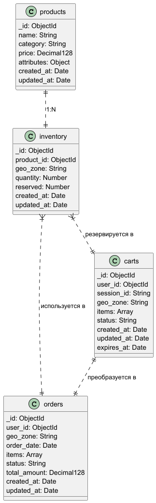

# Архитектурный документ: Шардирование MongoDB для "Мобильного мира"



## 1. Схемы коллекций

### 1.1 Коллекция `products`

```javascript
{
  _id: ObjectId, // уникальный идентификатор товара
  name: String, // наименование товара
  category: String, // категория товара
  price: Decimal128, // цена
  attributes: {
    color: String,
    size: String,
    // другие дополнительные атрибуты
  },
  created_at: Date,
  updated_at: Date
}
```
### 1.2 Коллекция inventory (отдельная коллекция для остатков)

```javascript
{
  _id: ObjectId,
  product_id: ObjectId, // ссылка на товар
  geo_zone: String, // геозона (москва, екатеринбург и т.д.)
  quantity: Number, // остаток в данной геозоне
  reserved: Number, // зарезервированное количество
  created_at: Date,
  updated_at: Date
}
```
### 1.3 Коллекция orders
```javascript
{
_id: ObjectId, // уникальный идентификатор заказа
user_id: ObjectId, // идентификатор клиента
geo_zone: String, // геозона заказа
order_date: Date, // дата и время оформления
items: [{
product_id: ObjectId,
product_name: String,
quantity: Number,
price: Decimal128,
category: String
}],
status: String, // статус заказа
total_amount: Decimal128, // общая сумма
created_at: Date,
updated_at: Date
}
```

### 1.4 Коллекция carts
```javascript
{
_id: ObjectId, // уникальный идентификатор корзины
user_id: ObjectId, // для авторизованных пользователей
session_id: String, // для гостей
geo_zone: String, // геозона корзины
items: [{
product_id: ObjectId,
quantity: Number,
added_at: Date
}],
status: String, // "active" | "ordered" | "abandoned"
created_at: Date,
updated_at: Date,
expires_at: Date // TTL для автоматической очистки
}
```

## 2. Шардирование коллекций

### 2.1 Стратегия шардирования для inventory и orders

#### Шард-ключ: {geo_zone: 1}

##### Обоснование:

Обеспечивает локализацию данных заказов и остатков в одной геозоне на одном шарде

Устраняет распределенные транзакции при создании заказов

Оптимизирует запросы по географическому признаку

#### Команды настройки шардирования:

```javascript
// Включение шардирования
sh.enableSharding("mobile_world");

// Создание индекса для шард-ключа
db.inventory.createIndex({ "geo_zone": 1 });
db.orders.createIndex({ "geo_zone": 1 });

// Шардирование коллекций
sh.shardCollection("mobile_world.inventory", { "geo_zone": 1 });
sh.shardCollection("mobile_world.orders", { "geo_zone": 1 });
```
#### 2.2 Стратегия шардирования для carts

##### Шард-ключ: {session_id: 1} для гостевых корзин, 

Для авторизованных пользователей создается специальный session_id

##### Обоснование:

Равномерное распределение корзин по шардам

Быстрый доступ к корзине по сессии или пользователю

Упрощение операции слияния корзин

##### Команда шардирования:
```javascript
db.carts.createIndex({ "session_id": 1 });
db.carts.createIndex({ "user_id": 1 });
sh.shardCollection("mobile_world.carts", { "session_id": 1 });
```
#### 2.3 Стратегия шардирования для products

##### Шард-ключ: {category: 1, _id: 1}

##### Обоснование:

Группировка товаров одной категории на одном шарде

Оптимизация поиска и фильтрации по категориям

Равномерное распределение нагрузки

##### Команда шардирования:
```javascript
db.products.createIndex({ "category": 1, "_id": 1 });
sh.shardCollection("mobile_world.products", { "category": 1, "_id": 1 });
```

## 4. Достоинства и недостатки подхода
### Достоинства:
   Географическая локализация: Заказы и остатки в одной геозоне находятся на одном шарде

* устранение распределенных транзакций: Критичные операции выполняются в пределах одного шарда

* Масштабируемость: Возможность добавлять шарды для новых геозон

* Производительность: Оптимизированные запросы по географическому признаку

### Недостатки:
* Неравномерное распределение: Геозоны с большим трафиком могут создавать горячие точки

* Сложность кросс-геозонных операций: Запросы, охватывающие несколько геозон, требуют scatter-gather

**Scatter-Gather** — это шаблон выполнения запросов в шардированных базах данных, при котором:
Scatter (разбрасывание) — запрос отправляется на все шарды
Gather (сбор) — результаты со всех шардов собираются и агрегируются

* Миграция данных: При изменении стратегии шардирования требуется сложная миграция